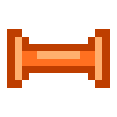

# FitBot 🤖💪

FitBot 是一款基于 **Material Design 3** 规范开发的 Android 健身追踪应用。该应用提供简约且专业的训练记录体验，支持结构化的周计划安排、全量 Google Drive 云同步以及直观的训练热力图统计。



## ✨ 核心功能

*   **🏃 18+ 专业动作库**：涵盖胸、背、肩、臂、腿、核心及全身训练，每个动作均配有专属的橙色火柴人动画演示。
*   **📅 结构化周计划**：支持以星期为维度安排训练与休息，可为每个动作自定义目标组数。
*   **✅ 智能进度打卡**：训练过程中自动追踪组数，达成目标后自动点亮当日任务。
*   **📊 训练热力图**：采用类似 GitHub 风格的自适应全景热力图，直观展现训练频率。
*   **☁️ 全量云同步**：通过 Google Drive API 实现训练记录、周计划及用户偏好（座右铭、主题、语言）的静默增量同步。
*   **🌓 个性化设置**：支持深色/浅色/跟随系统三态主题切换，以及中英文双语无缝切换。

## 🛠 技术栈

*   **UI 框架**：Jetpack Compose (1.6.1)
*   **设计规范**：Material Design 3
*   **数据库**：Room (2.6.1)
*   **异步处理**：Kotlin Coroutines & Flow
*   **后台任务**：WorkManager
*   **图片加载**：Coil (支持 GIF 渲染)
*   **持久化偏好**：DataStore
*   **云服务**：Google Drive REST API & Google Sign-In

## 🚀 快速开始

### 1. 环境准备
*   Android Studio Jellyfish | 2023.3.1 或更高版本
*   JDK 17 (推荐使用 Android Studio 内置的 JBR)
*   Android SDK 34 (Android 14)

### 2. 获取代码
```bash
git clone https://github.com/rayjun/fitbot.git
cd fitbot
```

### 3. 编译与安装

#### 使用 Android Studio (推荐)
1. 打开 Android Studio，通过 **Open** 选中项目目录。
2. 等待 Gradle 同步完成。
3. 连接安卓设备或启动模拟器（推荐使用 ARM64 架构镜像）。
4. 点击顶部的 **Run** 按钮进行编译与安装。

#### 使用命令行 (CLI)
在配置好 `ANDROID_HOME` 的环境下：

```bash
# 编译并生成 Debug 版 APK
./gradlew assembleDebug

# 安装到连接的设备
./gradlew installDebug
```

### 4. 生成发布包 (AAB)
```bash
./gradlew bundleDebug
```
生成的包路径：`app/build/outputs/bundle/debug/app-debug.aab`

## 📝 注意事项
*   **Google Drive 同步**：首次使用同步功能需在“个人中心”登录 Google 账号。由于采用 App Data Folder 存储，同步文件在 Google Drive 中处于隐藏状态，以确保数据安全。
*   **JDK 兼容性**：在某些环境下（如 JDK 21），编译 Android 34 项目可能会遇到 `jlink` 报错。本项目已在 `gradle.properties` 中添加兼容性配置，建议使用 JDK 17 进行构建。

## 📄 开源协议
本项目采用 [MIT License](LICENSE) 协议。
